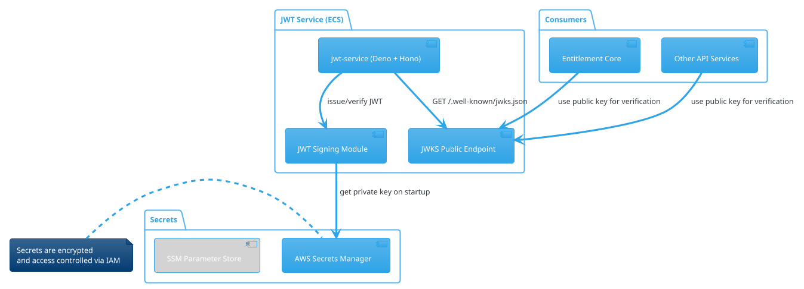

# JWT Service 構成図（PlantUML）

このドキュメントでは、PrepZen Lite における JWT Service の最小構成と、秘密鍵の安全な共有・使用方法について PlantUML で可視化します。

---

## ✅ JWT Service 最小構成図（PlantUML）

---

## ✅ 構成の要点

- **jwt-service** は stateless に動作し、ECS 上でスケーラブルに運用可能
- **秘密鍵（Private Key）は Secrets Manager または Parameter Store に格納**
  - 各ECSインスタンス起動時に1回だけ読み込み、メモリに保持
- **署名アルゴリズムはRS256/EdDSAなどを想定**
- **公開鍵は /.well-known/jwks.json で提供**
  - 他のAPIやサービスはこの公開鍵を使ってトークンを検証

---

この構成により、高セキュリティとスケーラビリティを両立したJWTサービスが実現できます。
